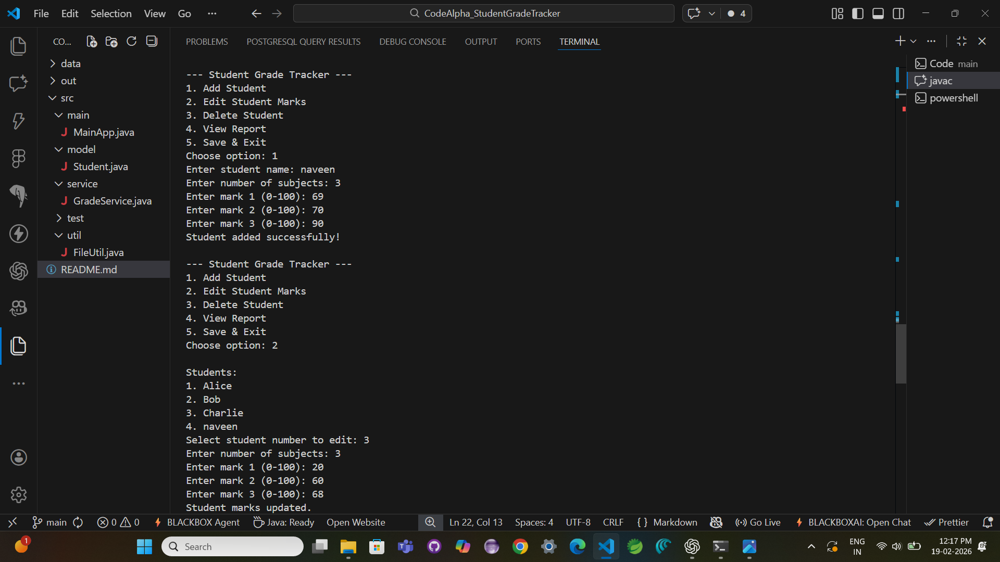

# Student Grade Tracker - Java

A Java console-based application to manage student grades.

## Features

- Add student details
- Edit existing student marks
- Delete students
- Calculate average, highest, and lowest marks
- Calculate letter grade (A/B/C/D/F)
- Display student performance report
- File-based data persistence

## Technologies Used

- Java
- OOP Concepts
- Collections
- File Handling

## How to Run

1. Compile all Java files
2. Run MainApp.java

### Example commands (from project root)

```powershell
javac -d out src/main/MainApp.java src/model/Student.java src/service/GradeService.java src/util/FileUtil.java
java -cp out main.MainApp
```

## Run Tests

```powershell
javac -d out src/model/Student.java src/service/GradeService.java src/util/FileUtil.java src/test/service/GradeServiceTest.java src/test/util/FileUtilTest.java
java -ea -cp out test.service.GradeServiceTest
java -ea -cp out test.util.FileUtilTest
```

# CodeAlpha_StudentGradeTracker

Student Grade Tracker is a Java-based console application designed to manage student academic records efficiently. The application allows users to add student details, store subject-wise marks, and calculate average, highest, and lowest scores. It uses Object-Oriented Programming principles, Java Collections, and File Handling to ensure structured.

## 📸 Project Output Screenshots

<p align="center">
  
</p>

<p align="center">
  
</p>
